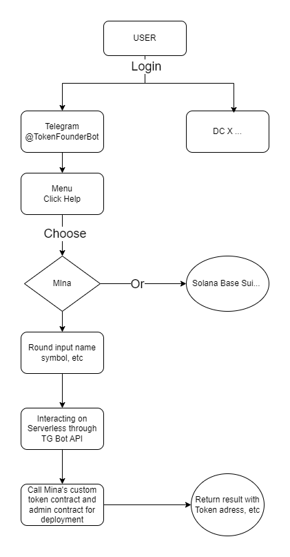

## Basic Info

Project Name: TokenFounder

## Project Details

### Introduction
Create tokens for any public-chain on Telegram for anyone, anytime.

### Background
It is necessary to immediately create memes for different social media platforms. Compared to traditional methods such as deploying tokens or creating tokens by opening a PC webpage, this approach significantly improves cost and efficiency.

### Insights
The goal of TokenFounder is to build cross platform, multi chain, and project solutions that enable one click token creation for promising public chains. By promoting meme tokens on the chain, we can stimulate the number of public chain users and TVL.

### User Workflow

## PPT
https://token-founder.vercel.app/

## Telegram Bot
https://t.me/TokenFounderBot

## Done to do during hackathon

- [×] Custom Fungible Token Control and Deployment to Mina Test Network, and Validation.
- [×] Writing and calling TG bot API.
- [×] Release TokenFounder-Mina to one serverless platform.

## Team members

- Pursue: Technical Development Engineer, engaged in fields related to Blockchain, Cloud Computing Virtualization, Web backend, etc. GitHub: @aiqubits
